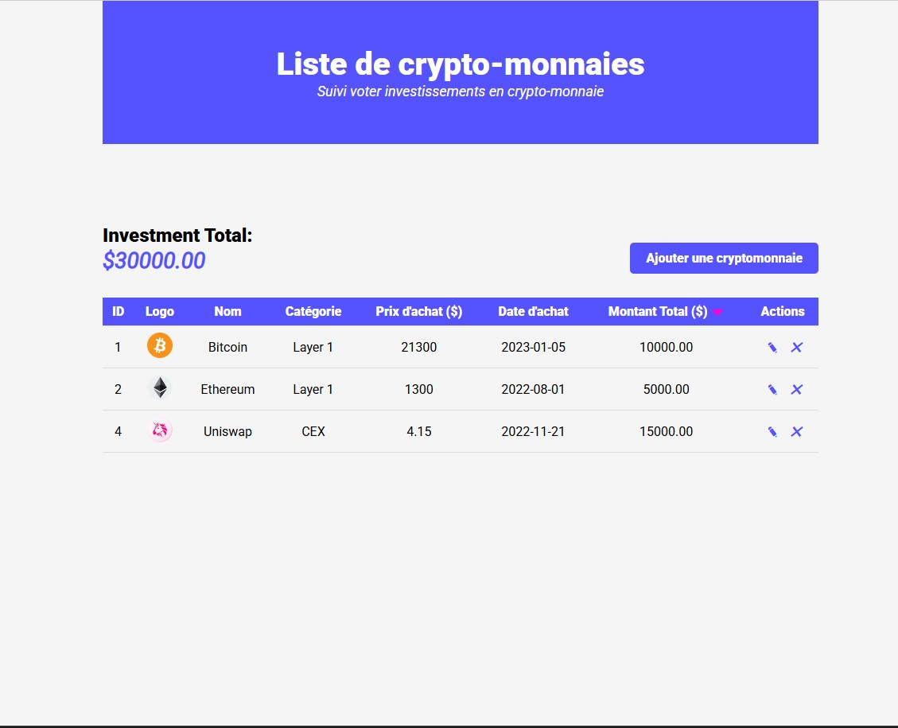

# 🎓 School Projects Portfolio

Welcome to my **School Projects Portfolio**!  
This repository groups all my academic, training, and internship projects completed using:

- JavaScript, TypeScript  
- Vue.js, MEVN stack  
- HTML, CSS, Sass, Bootstrap  
- .NET (team projects)  
- Git, GitHub, Bitbucket  
- Agile workflow using Jira  
- Figma → Frontend Integration  

Each project below includes a description, screenshot placeholder, and link.

---

# 📂 Projects Overview

---

## 🔥 1. **Crypto Portfolio Tracker**
---

**Tech:** JavaScript, HTML, CSS, LocalStorage  
**Features:**  
- Add, delete, and update crypto assets  
- Auto-calculation of total portfolio value  
- CRUD operations  
- Clean UI table  
- Fully client-side  

**Description:**  
A simple portfolio tracker where users can add crypto assets, edit them, delete them, and calculate the total value.  

📸 **Screenshot:**  

🔗 **Project Link:**   [Here](https://github.com/OualidSaheb/School-Projects/tree/main/Crypto-Portfolio-Tracker)
---

## 📝 2. **Super Duper Task Manager**  
**Tech:** TypeScript, HTML, CSS  
**Features:**  
- Simple task management  
- Add / remove / complete tasks  
- Clean UI and reusable components

**Description:**  
A small project that manages tasks—add, delete, complete—built to practice TypeScript basics.  

📸 **Screenshot:**  

🔗 **Project Link:**  [Here](https://github.com/OualidSaheb/School-Projects/tree/main/Super-Duper-Task-Manager)
---

## 🛒 3. **TWENTY — E-commerce Website (MEVN Full Stack)**  
**Tech:** MEVN (MongoDB, Express, Vue.js, Node.js), Pinia, Axios, Components  
**Team workflow:**  
- Figma UI → front-end implementation  
- Git & Bitbucket  
- Agile with Jira  
- Postman testing  
- Merge requests & code reviews  

**Description:**  
A full-stack e-commerce platform with authentication, product management, and dynamic UI using Vue + Pinia. Backend built with Express/MongoDB.  

📸 **Screenshot:**  

🔗 **Project Link:**  [Here](https://github.com/OualidSaheb/School-Projects/tree/main/TWENTY-Ecom%20website)

---

## 🎓 4. **For-Mat LMS — Learning Management System**  
**Tech:** Vue.js, Pinia, Axios, .NET backend (team project)  
**My role:**  
- Front-end development  
- UI components  
- Routing, APIs, state management  
- Git & GitHub collaboration    

**Description:**  
A collaborative project to create an LMS platform for student and course management. I contributed to frontend components, API integration, and Pinia state management.  

📸 **Screenshot:**  

🔗 **Project Link:**  [Here](https://github.com/OualidSaheb/School-Projects/tree/main/For-Mat-LMS-Learning-Management-System-)

---

## 🏢 5. **Retroaction — Internship Project**  
**Tech:** Vue.js, Sass, Bootstrap 5, Axios, Pinia  
**Team workflow:**  
- UI/UX from Figma  
- Agile (Jira)  
- Bitbucket

**Description:**  
A real professional team internship project for managing user feedback and digital retroactions. Built reusable components, integrated APIs, and styled with Sass & Bootstrap.  

📸 **Screenshot:**  

🔗 **Project Link:**  [Here](https://github.com/OualidSaheb/School-Projects/tree/main/Retroaction)

---

# 🛠️ Skills Used

### **Frontend**
- Vue.js  
- Pinia  
- TypeScript  
- HTML/CSS  
- Bootstrap 5  
- Sass

### **Backend**
- Node.js  
- Express.js  
- MongoDB  
- .NET (team projects)  

### **Tools & Workflow**
- Git, GitHub, Bitbucket  
- Jira (Agile sprints, tasks, merge requests)  
- Figma → Frontend implementation  
- Postman (API testing)  

---

